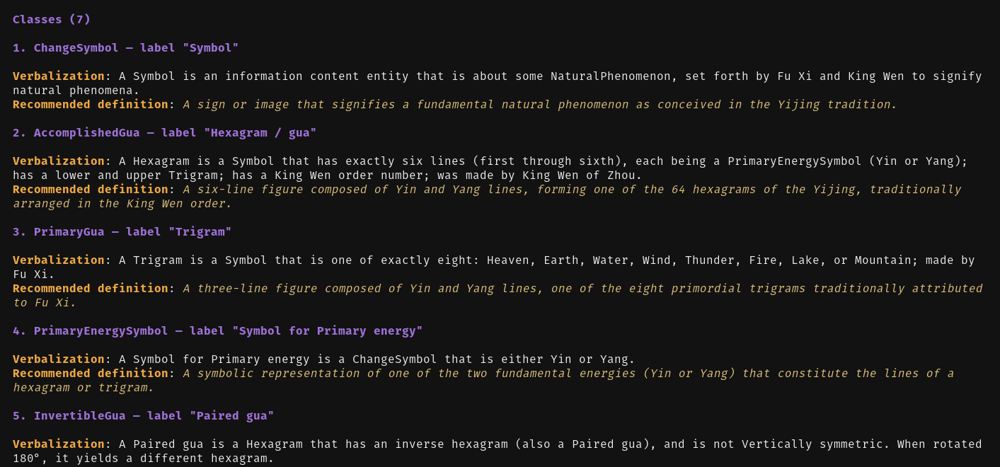
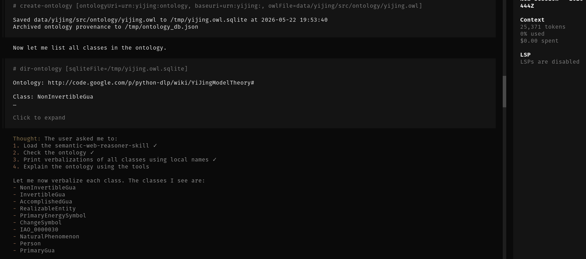

# Semantic Web Reasoner Skill
An OpenCode / Claude skill for Semantic Web (SW) architecture and development using tool-aware LLMs and VLM, and taking full 
advantage of reasoners and SW tools such as FuXi, robot, riot, etc.

See [SKILL.md](skills/semantic-web-reasoner-skill/SKILL.md)

Example of verbalization with the `verbalize-ontology-class` tool, using [owl_dsl](https://github.com/chimezie/owl_dsl)
to render controlled natural language phrases of an ontology and using this to suggest values for 
[the Information Artiface Ontology's (IAO)](https://obofoundry.org/ontology/iao.html) definition annotation property:

This is a useful workflow pattern for ontology management and Q/A

Here, the [unsloth/Qwen3.6-35B-A3B-UD-MLX-4bit](https://huggingface.co/unsloth/Qwen3.6-35B-A3B-UD-MLX-4bit) open-weight 
model is used, demonstrating capability on a commodity GPU.

Below is an example of storing an ontology for use with owl-dsl and owlready2 as well as owl_dsl to render
the ontology terms in Manchester Owl Syntax:

See a [Virtuoso example](https://linkeddata.uriburner.com/DAV/demos/daas/fuxi-reasoning-2-kg.html) of using it to 
generate a SPARQL INSERT for upload to a local instance. 

Virtuoso has [a Agent Skills repo](https://github.com/OpenLinkSoftware/ai-agent-skills)